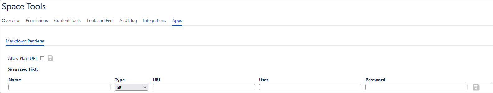
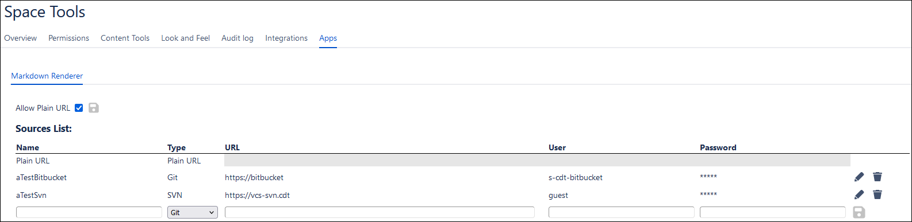

## Description
The plugin Implements a confluence macro to render remote markdown file from various pre-defined sources (e.g. Git, Subversion, ...) on Confluence Wiki pages. 
Rendering is performed using [flexmark-java](https://github.com/vsch/flexmark-java) library.

## Administrator Configuration
### Source List Configuration
The Space Admin (or user with such privileges) must be responsible for defining and maintaining the list of sources the plugin shall propose to the users.
This list can be reached and amended through the following steps:
1. As Space Admin, go to "Space Tools" --> "Apps"
2. In the screen select "Markdown Renderer" tab
3. There you should see the following screen:
 
Checking "Allow Plain URL" enables usage of Plain URL source for user, refer to section [Plain URL Parameters](#1) for more information. 
"Sources List" presents the table of sources that plugin shall propose to users. From there you can view, add and delete sources.
  Each source has the following parameters:
   * Name -> name of the source, must be unique
   * Type -> source type either Git, SVN or Plain URL (last one is technical and cannot be directly added by Admin)
   * URL -> base address of the files repository
   * User -> username of the user used to connect to files repository. It is advised to use a pre-defined technical user and not a personal one.
   * Password -> password of the user used to connect to files repository.

Here is an example of a configured Sources List:

## User Configuration
When using the plugin, depending on the underlying source type of the source selected by the user in the "Edit ´Markdown Renderer Plugin Macro´ Macro screen", various parameters should be filled.

### Git Parameters
| Name                  | Required | Default Value | Description                                                            |
|-----------------------|----------|---------------|------------------------------------------------------------------------|
| Project Key           | Y        | N/A           | Key of the project                                                     |
| Main Repository       | Y        | N/A           | Repository within project/client folder where markdown file is located |
| Path to Markdown File | Y        | N/A           | Path from Main Repository to markdown file                             |
| Branch                | N        | master        | Branch name                                                            |

### Subversion Parameters
| Name                  | Required | Default Value | Description                                   |
|-----------------------|----------|---------------|-----------------------------------------------|
| Client Country        | Y        | N/A           | Client country name                           |
| Client Code           | Y        | N/A           | Customer code                                 |
| Branch Path           | N        | branches/int  | Path from Client Code folder to Branch folder |
| Path to Markdown File | Y        | N/A           | Path from Branch folder to markdown file      |

###  Plain URL Parameters
| Name             | Required | Default Value | Description                                                |
|------------------|----------|---------------|------------------------------------------------------------|
| Plain URL        | Y        | N/A           | Complete URL, with clear username and password within it   |

**N.B.** This approach is mainly kept for legacy reasons but using it is unadvised as it uses clear credentials, which might pose a security risk.

## Features

Only HTTPS protocol is supported for Git. For Subversion and Plain URL, both HTTP and HTTPS are supported.

Images can be embedded either through their direct base64 string representation or through their relative path to the markdown file being rendered.

Supported Wiki extensions:
* Tables
* Table of Contents
* Code block

## Revision history
| Version | Date       | Author          | Confluence version | Description      |
|---------|------------|-----------------|--------------------|------------------|
| 01.00   | 12.04.2024 | Gautier Devuyst | 8.5.4              | Initial version. |